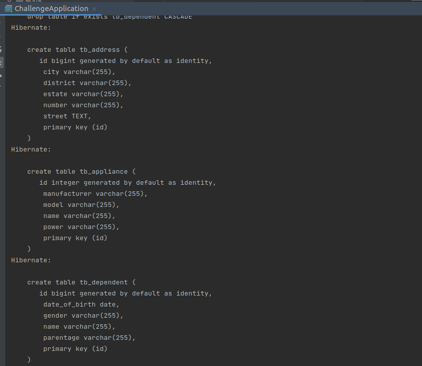
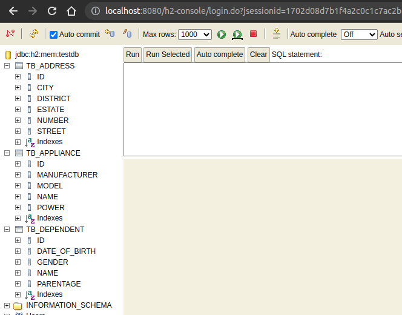
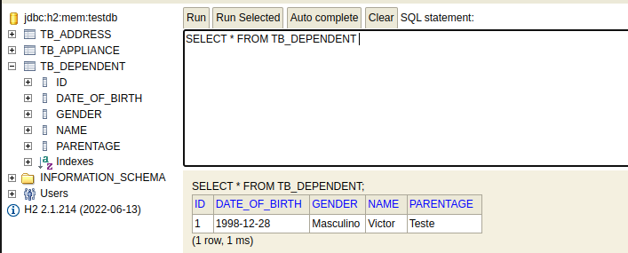
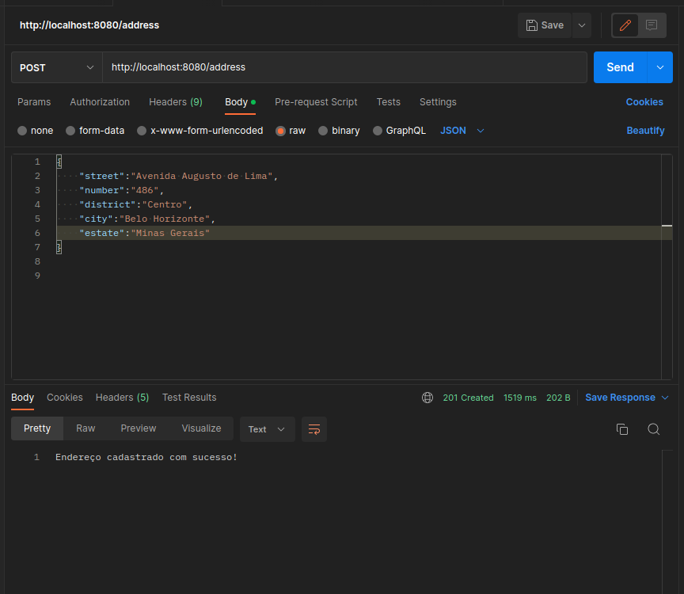
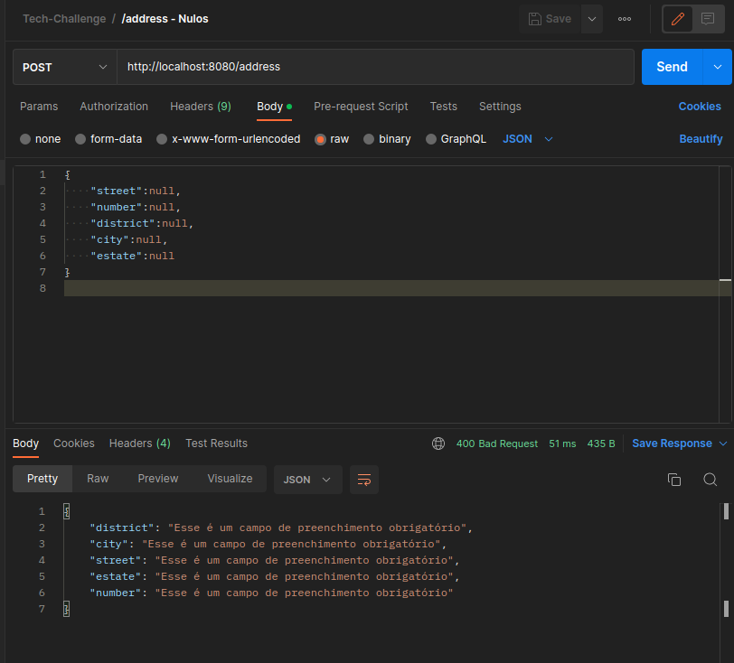
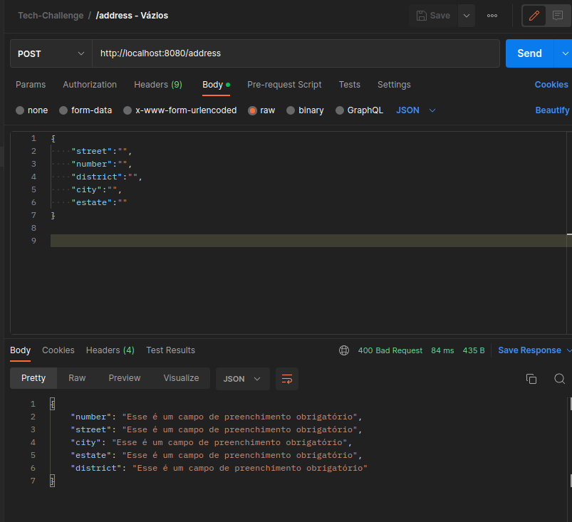
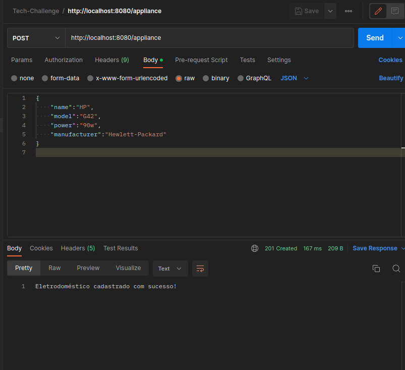
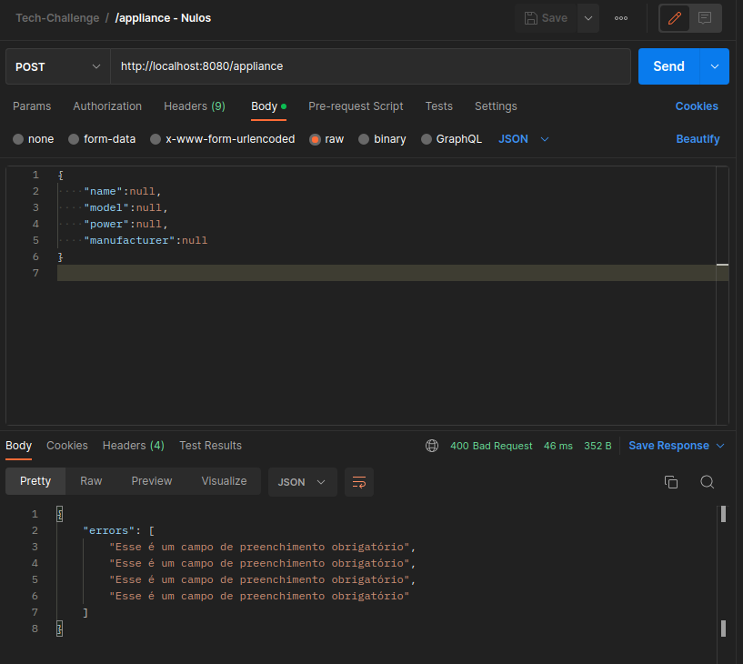
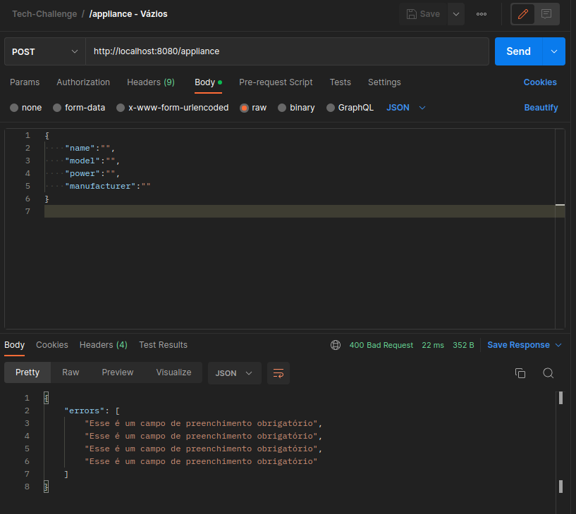

# tech-challenge
## Repositório para o Tech Challenge - Grupo 30

### 1- Relatório Técnico - Grupo 30
Inicialmente foram definidas as versões que seriam utilizadas no projeto:
+ Maven
+  Java 11
+  Spring Boot 2.7.12

Também realizamos a definição das bibliotecas que seriam utilizadas:
+  Spring Web
+  Lombok
+  H2 Database

Quanto à versão utilizada do Java, decidimos utilizar a versão 11 por entender que hoje esta versão é mais utilizada no mercado e também consideramos a mais estável.

Optamos por utilizar um banco de dados em memória, apesar de não ser requisito, por entendermos que facilitaria a evolução do projeto na próxima etapa sem adicionar complexidade.

Também optamos pelo Spring Starter Validation para validar os dados de entrada.

Essas tecnologias e ferramentas contribuíram para o desenvolvimento eficiente e robusto do sistema, que em conjunto com reuniões semanais e distribuição de tarefas para cada integrante do grupo, possibilitou atingirmos os objetivos propostos no desafio.

A principal dificultade encontrada foi a necessidade de se realizar algumas refatorações afim de padronizar o código das 3 APIs, já que estavam significativamente diferentes em seu formato devido as preferências individuais de cada desenvolverdor.


### 2- Documentação API
#### ---- INSTÂNCIA DE ENTIDADES PARA BD EM MEMÓRIA ----






#### ---- DEPENDENTES ----

Pessoas relacionadas ao nosso cliente, com algum nível de parentesco.

- Json da classe de Dependentes para o Postman com todos os campos preenchidos. 
```json
{
    "name":"Victor",
    "dateOfBirth":"28/12/1998",
    "gender":"Masculino",
    "parentage":"Teste"
}
```
- Resposta da requisição


- Dados inseridos no banco



- Json da classe de Dependentes para o Postman com todos os campos nulos. 


- Json da classe de Dependentes para o Postman com todos os campos vazios. 


#### ---- ENDEREÇOS ----

URL: http://localhost:8080/address

- Json da classe de Endereços para o Postman com todos os campos preenchidos.

```json
{
  "street":"Avenida Augusto de Lima",
  "number":"486",
  "district":"Centro",
  "city":"Belo Horizonte",
  "estate":"Minas Gerais"
}

```
- Resposta da requisição


- Dados inseridos no banco


- Json da classe de Endereços para o Postman com todos os campos nulos.


- Json da classe de Endereços para o Postman com todos os campos vazios.



#### ---- ELETRODOMÉSTICOS ----

URL: http://localhost:8080/appliance

- Json da classe de Eletrodomésticos para o Postman com todos os campos preenchidos. 

```json
{
  "name":"HP",
  "model":"G42",
  "power":"90w",
  "manufacturer":"Hewlett-Packard"
}

```
- Resposta da requisição


- Dados inseridos no banco


- Json da classe de Eletrodomésticos para o Postman com todos os campos nulos.



- Json da classe de Eletrodomésticos para o Postman com todos os campos vazios.



