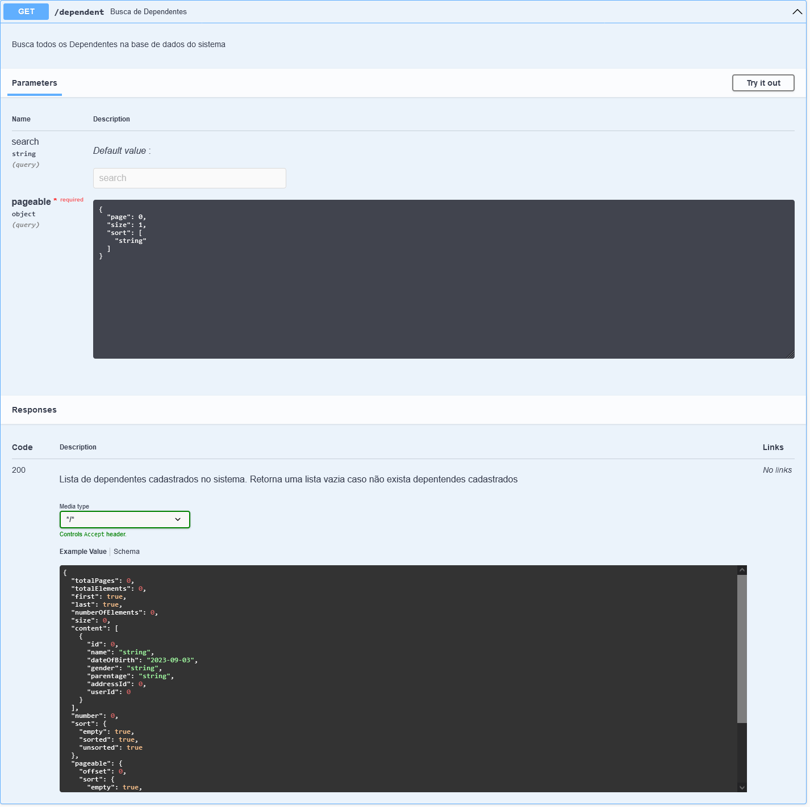
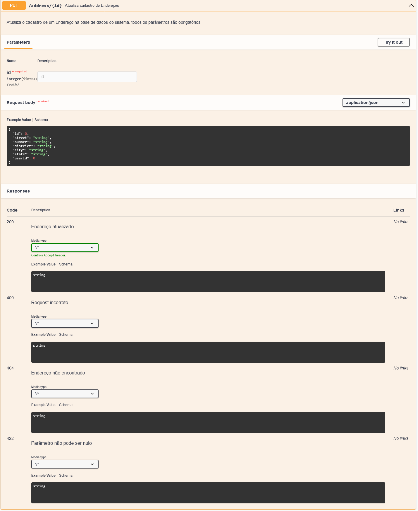

# tech-challenge
## Repositório para o Tech Challenge - Grupo 30

### 1.1- Relatório Técnico - Grupo 30 - Fase 1
Inicialmente foram definidas as versões que seriam utilizadas no projeto:
+ Maven
+  Java 11
+  Spring Boot 2.7.12

Também realizamos a definição das bibliotecas que seriam utilizadas:
+  Spring Web
+  Lombok
+  H2 Database

Quanto à versão utilizada do Java, decidimos utilizar a versão 11 por entender que hoje esta versão é mais utilizada no mercado e também consideramos a mais estável.

Optamos por utilizar um banco de dados em memória, apesar de não ser requisito, por entendermos que facilitaria a evolução do projeto na próxima etapa sem adicionar complexidade.

Também optamos pelo Spring Starter Validation para validar os dados de entrada.

Essas tecnologias e ferramentas contribuíram para o desenvolvimento eficiente e robusto do sistema, que em conjunto com reuniões semanais e distribuição de tarefas para cada integrante do grupo, possibilitou atingirmos os objetivos propostos no desafio.

A principal dificultade encontrada foi a necessidade de se realizar algumas refatorações afim de padronizar o código das 3 APIs, já que estavam significativamente diferentes em seu formato devido as preferências individuais de cada desenvolverdor.

### 1.2- Relatório Técnico - Grupo 30 - Fase 2

No início da fase 02 decidimos atualizar a versão do Java e Spring Boot para termos a possibilidade de utilizarmos novas funcionalidades da linguagem:
+  Java 17
+  Spring Boot 3.1.2

Além das bibliotecas já utilizadas na fase 1, adicionamos também as bibliotecas abaixo:
+  PostgreSQL
+  SpringDoc OpenAPI Starter WebMVC UI

Na fase 1 utilizamos um banco de dados em memória (H2 Database), nesta fase adicionamos a possibilidade de conectar a aplicação a um banco de dados real utilizando a biblioteca do PostgreSQL. A configuração para a aplicação conectar-se no H2 ou PostgreSQL deve ser feita no arquivo application.properties, onde deve ser definido qual profile a aplicação vai rodar, test para rodar o banco em memória H2 ou dev para rodar o banco PostgreSQL:
https://github.com/rcsim/tech-challenge/blob/0fcd8e3b718870e622972ce1b11d62cb7c5bbd81/src/main/resources/application.properties#L1 

Configuração do H2:
https://github.com/rcsim/tech-challenge/blob/0fcd8e3b718870e622972ce1b11d62cb7c5bbd81/src/main/resources/application-test.properties#L1-L15

Configuração do PostgreSQL:
https://github.com/rcsim/tech-challenge/blob/0fcd8e3b718870e622972ce1b11d62cb7c5bbd81/src/main/resources/application-dev.properties#L1-L7

Nesta fase adicionamos a possibilidade de geração automática da documentação através da biblioteca SpringDoc OpenAPI, a documentação pode ser acessada enquanto a aplicação estiver rodando em http://localhost:8080/swagger-ui/index.html#/:

**Docker**

Nesta fase foi adicionado a possibilidade de utilização de containers através do Docker-Compose. Criamos um container para aplicação e outro para o banco de dados e uma rede no modo bridge para ter acesso ao containers via localhost:

https://github.com/rcsim/tech-challenge/blob/0fcd8e3b718870e622972ce1b11d62cb7c5bbd81/docker-compose.yml#L1-L33

Também adicionamos o arquivo Dockerfile que gerencia o processo de build da aplicação através do Maven e JDK, já inicializando a aplicação:

https://github.com/rcsim/tech-challenge/blob/0fcd8e3b718870e622972ce1b11d62cb7c5bbd81/Dockerfile#L1-L15

Para criação dos container, compilar e rodar a applicação é necessário apenas o comando:

docker-compose up -d

**Banco de Dados**

Ao utilizarmos um container para o PostgreSQL, foi necessário a criação de dois arquivos, uma para configuração do schema e outro para seed de alguns dados para facilitar os testes:
https://github.com/rcsim/tech-challenge/blob/7eda16eec709df6d1ad3b58cea2d7e4788a03ff4/01-schema.sql#L1-L48

https://github.com/rcsim/tech-challenge/blob/7eda16eec709df6d1ad3b58cea2d7e4788a03ff4/02-seed.sql#L1-L38
Os dados de seeding são fictícios e foram gerados em https://www.4devs.com.br/

### 2- Documentação API
#### ---- INSTÂNCIA DE ENTIDADES PARA BD EM MEMÓRIA ----

#### ---- DEPENDENTES ----

URL: http://localhost:8080/dependent

- **Endpoint**: `/dependent/{id}`
- **Método**: DELETE
- **Descrição**: Remove um dependente do banco de dados.
- **Resposta**:
  - 200: Dependente removido com sucesso.
  - 404: Dependente não encontrado.

- **Endpoint**: `/dependent`
- **Método**: GET
- **Descrição**: Recupera todos os dependentes do banco de dados.
- **Resposta**:
  - 200: Lista de dependentes registrados no sistema. Retorna uma lista vazia se não houver dependentes.

- **Endpoint**: `/dependent/{id}`
- **Método**: GET
- **Descrição**: Recupera um dependente por ID do banco de dados.
- **Resposta**:
  - 200: Retorna o dependente correspondente ao ID fornecido e registrado no sistema.
  - 404: Dependente não encontrado.

- **Endpoint**: `/dependent/{id}/appliances`
- **Método**: GET
- **Descrição**: Recupera uma lista de eletrodomésticos associados a um dependente.
- **Resposta**:
  - 200: Lista de eletrodomésticos registrados no sistema e associados a um dependente. Retorna uma lista vazia se não houver eletrodomésticos.
  - 404: Dependente não encontrado.

- **Endpoint**: `/dependent`
- **Método**: POST
- **Descrição**: Adiciona um dependente ao banco de dados. Todos os parâmetros são obrigatórios.
- **Corpo da Requisição**: Dados do dependente em formato JSON.
- **Resposta**:
  - 201: Dependente adicionado.
  - 422: O parâmetro não pode ser nulo.
  - 400: Requisição incorreta.
  - 404: Não é possível registrar em um endereço inexistente.

- **Endpoint**: `/dependent/{id}`
- **Método**: PUT
- **Descrição**: Atualiza o registro de um dependente no banco de dados. Todos os parâmetros são obrigatórios.
- **Corpo da Requisição**: Dados do dependente em formato JSON.
- **Resposta**:
  - 200: Dependente atualizado.
  - 422: O parâmetro não pode ser nulo.
  - 400: Requisição incorreta.
  - 404: Dependente não encontrado.

#### ---- ENDEREÇOS ----

URL: http://localhost:8080/address

- **Endpoint**: `/address/{id}`
- **Método**: DELETE
- **Descrição**: Remove um endereço do banco de dados.
- **Resposta**:
  - 200: Endereço removido com sucesso.
  - 404: Endereço não encontrado.

- **Endpoint**: `/address`
- **Método**: GET
- **Descrição**: Recupera todos os endereços do banco de dados.
- **Resposta**:
  - 200: Lista de endereços registrados no sistema. Retorna uma lista vazia se não houver endereços.

- **Endpoint**: `/address/{id}`
- **Método**: GET
- **Descrição**: Recupera um endereço por ID do banco de dados.
- **Resposta**:
  - 200: Retorna o endereço correspondente ao ID fornecido e registrado no sistema.
  - 404: Endereço não encontrado.

- **Endpoint**: `/address/{id}/appliances`
- **Método**: GET
- **Descrição**: Recupera uma lista de eletrodomésticos associados a um endereço.
- **Resposta**:
  - 200: Lista de eletrodomésticos registrados no sistema e associados a um endereço. Retorna uma lista vazia se não houver eletrodomésticos.

- **Endpoint**: `/address/{id}/dependents`
- **Método**: GET
- **Descrição**: Recupera uma lista de dependentes associados a um endereço.
- **Resposta**:
  - 200: Lista de dependentes registrados no sistema e associados a um endereço. Retorna uma lista vazia se não houver dependentes.
  - 404: Endereço não encontrado.

- **Endpoint**: `/address`
- **Método**: POST
- **Descrição**: Adiciona um endereço ao banco de dados. Todos os parâmetros são obrigatórios.
- **Corpo da Requisição**: Dados do endereço em formato JSON.
- **Resposta**:
  - 201: Endereço adicionado.
  - 422: O parâmetro não pode ser nulo.
  - 400: Requisição incorreta.

- **Endpoint**: `/address/{id}`
- **Método**: PUT
- **Descrição**: Atualiza o registro de um endereço no banco de dados. Todos os parâmetros são obrigatórios.
- **Corpo da Requisição**: Dados do endereço em formato JSON.
- **Resposta**:
  - 200: Endereço atualizado.
  - 422: O parâmetro não pode ser nulo.
  - 404: Endereço não encontrado.
  - 400: Requisição incorreta.

#### ---- ELETRODOMÉSTICOS ----

URL: http://localhost:8080/appliance

- **Endpoint**: `/appliance/{id}`
- **Método**: DELETE
- **Descrição**: Remove um eletrodoméstico do banco de dados.
- **Resposta**:
  - 200: Eletrodoméstico removido com sucesso.
  - 404: Eletrodoméstico não encontrado.

- **Endpoint**: `/appliance`
- **Método**: GET
- **Descrição**: Recupera todos os eletrodomésticos do banco de dados.
- **Resposta**:
  - 200: Lista de eletrodomésticos registrados no sistema. Retorna uma lista vazia se não houver eletrodomésticos.

- **Endpoint**: `/appliance/{id}`
- **Método**: GET
- **Descrição**: Recupera um eletrodoméstico por ID do banco de dados.
- **Resposta**:
  - 200: Retorna o eletrodoméstico correspondente ao ID fornecido e registrado no sistema.
  - 404: Eletrodoméstico não encontrado.

- **Endpoint**: `/appliance/{id}/dependent`
- **Método**: GET
- **Descrição**: Recupera uma lista de dependentes associados a um eletrodoméstico.
- **Resposta**:
  - 200: Lista de dependentes registrados no sistema e associados a um eletrodoméstico. Retorna uma lista vazia se não houver dependentes.
  - 404: Eletrodoméstico não encontrado.

- **Endpoint**: `/appliance`
- **Método**: POST
- **Descrição**: Adiciona um eletrodoméstico ao banco de dados. Todos os parâmetros são obrigatórios.
- **Corpo da Requisição**: Dados do eletrodoméstico em formato JSON.
- **Resposta**:
  - 201: Eletrodoméstico adicionado.
  - 422: O parâmetro não pode ser nulo.
  - 400: Requisição incorreta.
  - 404: Não é possível registrar em um endereço inexistente.

- **Endpoint**: `/appliance/{id}`
- **Método**: PUT
- **Descrição**: Atualiza o registro de um eletrodoméstico no banco de dados. Todos os parâmetros são obrigatórios.
- **Corpo da Requisição**: Dados do eletrodoméstico em formato JSON.
- **Resposta**:
  - 200: Eletrodoméstico atualizado.
  - 422: O parâmetro não pode ser nulo.
  - 404: Eletrodoméstico não encontrado.
  - 400: Requisição incorreta.

