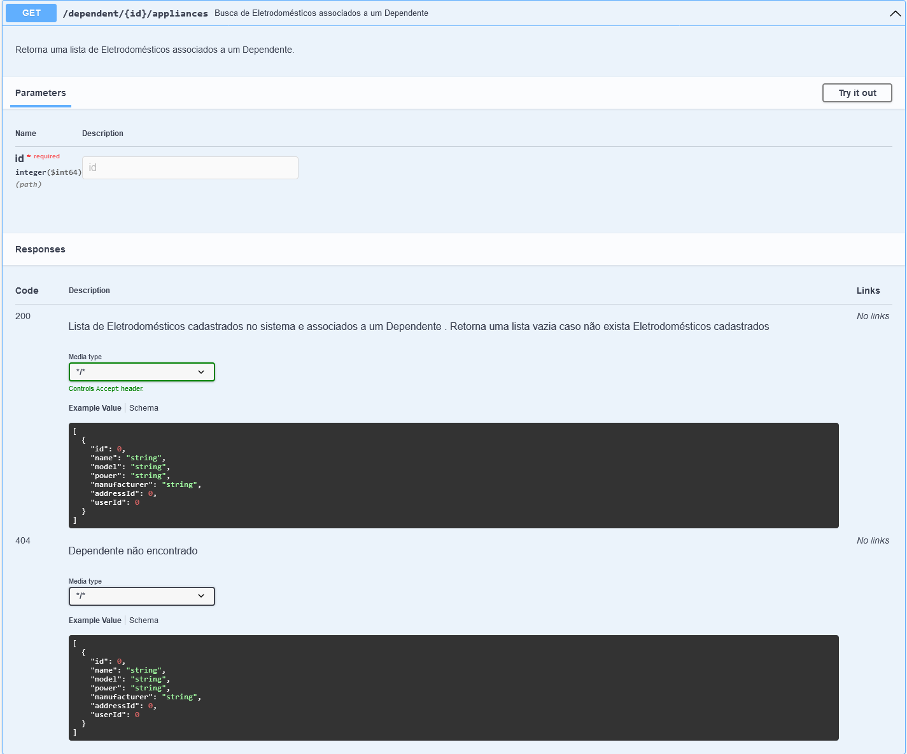

# tech-challenge
## Repositório para o Tech Challenge - Grupo 30

### 1.1- Relatório Técnico - Grupo 30 - Fase 1
Inicialmente foram definidas as versões que seriam utilizadas no projeto:
+ Maven
+  Java 11
+  Spring Boot 2.7.12

Também realizamos a definição das bibliotecas que seriam utilizadas:
+  Spring Web
+  Lombok
+  H2 Database

Quanto à versão utilizada do Java, decidimos utilizar a versão 11 por entender que hoje esta versão é mais utilizada no mercado e também consideramos a mais estável.

Optamos por utilizar um banco de dados em memória, apesar de não ser requisito, por entendermos que facilitaria a evolução do projeto na próxima etapa sem adicionar complexidade.

Também optamos pelo Spring Starter Validation para validar os dados de entrada.

Essas tecnologias e ferramentas contribuíram para o desenvolvimento eficiente e robusto do sistema, que em conjunto com reuniões semanais e distribuição de tarefas para cada integrante do grupo, possibilitou atingirmos os objetivos propostos no desafio.

A principal dificultade encontrada foi a necessidade de se realizar algumas refatorações afim de padronizar o código das 3 APIs, já que estavam significativamente diferentes em seu formato devido as preferências individuais de cada desenvolverdor.

### 1.2- Relatório Técnico - Grupo 30 - Fase 2

No início da fase 02 decidimos atualizar a versão do Java e Spring Boot para termos a possibilidade de utilizarmos novas funcionalidades da linguagem:
+  Java 17
+  Spring Boot 3.1.2

Além das bibliotecas já utilizadas na fase 1, adicionamos também as bibliotecas abaixo:
+  PostgreSQL
+  SpringDoc OpenAPI Starter WebMVC UI

Na fase 1 utilizamos um banco de dados em memória (H2 Database), nesta fase adicionamos a possibilidade de conectar a aplicação a um banco de dados real utilizando a biblioteca do PostgreSQL. A configuração para a aplicação conectar-se no H2 ou PostgreSQL deve ser feita no arquivo application.properties, onde deve ser definido qual profile a aplicação vai rodar, test para rodar o banco em memória H2 ou dev para rodar o banco PostgreSQL:
https://github.com/rcsim/tech-challenge/blob/0fcd8e3b718870e622972ce1b11d62cb7c5bbd81/src/main/resources/application.properties#L1 

Configuração do H2:
https://github.com/rcsim/tech-challenge/blob/0fcd8e3b718870e622972ce1b11d62cb7c5bbd81/src/main/resources/application-test.properties#L1-L15

Configuração do PostgreSQL:
https://github.com/rcsim/tech-challenge/blob/0fcd8e3b718870e622972ce1b11d62cb7c5bbd81/src/main/resources/application-dev.properties#L1-L7

Nesta fase adicionamos a possibilidade de geração automática da documentação através da biblioteca SpringDoc OpenAPI, a documentação pode ser acessada enquanto a aplicação estiver rodando em http://localhost:8080/swagger-ui/index.html#/:

### 2- Documentação API
#### ---- INSTÂNCIA DE ENTIDADES PARA BD EM MEMÓRIA ----

#### ---- DEPENDENTES ----

URL: http://localhost:8080/dependent

#### ---- ENDEREÇOS ----

URL: http://localhost:8080/address

#### ---- ELETRODOMÉSTICOS ----

URL: http://localhost:8080/appliance

